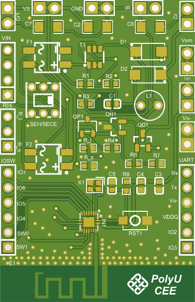

# Compact IoT Board for Electromechanical Metamaterials

 *(Replace with actual image path)*

This repository contains the open-source design files for a compact, self-powered IoT board featuring energy harvesting management, adjustable voltage regulation, and ultra-low-power Bluetooth Beacon functionality.

## Key Features

- **Energy Harvesting Interface**: Compatible with SECE (Synchronous Electric Charge Extraction) interface circuits.
- **Three-Transistor Energy Management**: 
  - Adjustable regulation voltage thresholds (`V_ON` and `V_OFF`)
  - Regulated output voltage ~2.3V (suitable for most IoT SoCs)
  - Design based on depletion-mode n-channel MOSFET
- **Ultra-Low-Power Bluetooth Beacon**:
  - IN100 SoC for temperature and 3-axis acceleration sensing
  - BMA400 accelerometer via I²C
  - Bluetooth 5 broadcast (channels 37-39) at 1s intervals
- **Power-Saving Operation**:
  - Dynamic sleep/wake cycles
  - Load switch for external sensor power management
- **Configurable Thresholds**:
  - Adjustable `V_ON` via onboard resistor `R5` selection
  - Supports heavy-sensing and transmission tasks

## Repository Contents

- `/hardware`:
  - PCB fabrication files (Gerber, BOM, etc.)
  - Schematic (PDF and native format)
  - 3D model files
- `/firmware`:
  - IN100 configuration code
  - Sensor interface code
- `/documentation`:
  - Detailed specifications
  - Assembly guide
  - Performance characteristics (see table below)

## Technical Specifications

| Parameter          | Value/Range       |
|--------------------|-------------------|
| Input Voltage Range | Depends on SECE interface |
| Regulated Output   | ~2.3V             |
| Bluetooth Standard | Bluetooth 5       |
| Broadcast Interval | 1 second          |
| Sensors            | On-chip temperature, BMA400 3-axis accelerometer |
| Sleep Current      | [Value] μA        |
| Active Current     | [Value] mA        |

## Getting Started

1. **Manufacturing**:
   - Use the Gerber files in `/hardware` for PCB fabrication
   - Refer to BOM for component sourcing

2. **Assembly**:
   - Follow the assembly guide in `/documentation`
   - Select `R5` for desired threshold voltage

3. **Programming**:
   - Flash the IN100 SoC using the firmware in `/firmware`
   - Configure broadcast parameters as needed

## References

- Energy management circuit based on:  
  Teng et al. "Three-transistor design for adjustable regulation voltage thresholds" (2023)
- IN100 SoC datasheet: [Manufacturer Documentation]

## License

[Specify your license here, e.g., MIT, Apache 2.0, etc.]

## Contributing

Contributions are welcome! Please submit issues or pull requests for any improvements.

---

*For detailed performance characteristics and design considerations, refer to the documentation and cited papers.*
